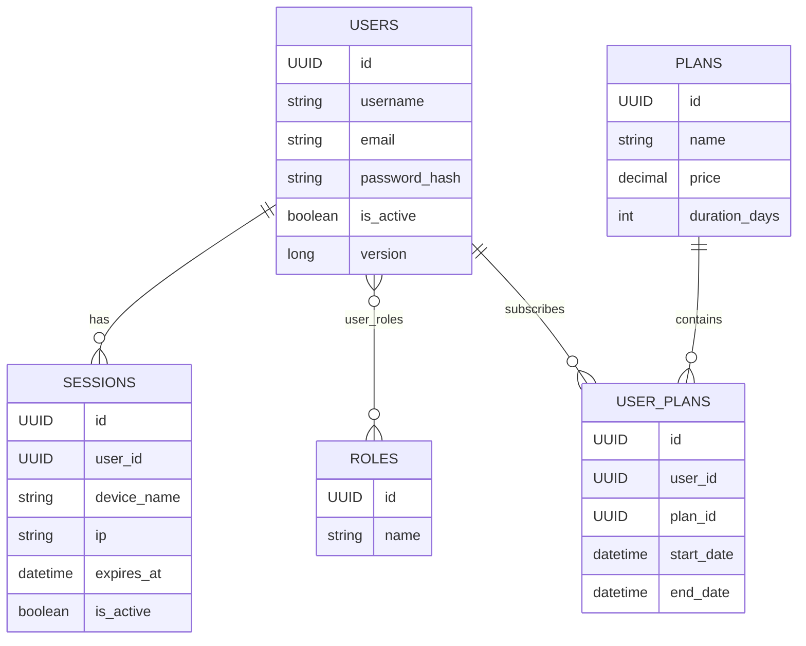

# ViRe Backend <!-- Project Title -->

<p align="center">
  A fast, private & secure VPN service API.
</p>

[](LICENSE)

---

## Table of Contents
1. [Purpose](#purpose)
2. [Getting Started](#getting-started)
3. [Tech Stack](#tech-stack)
4. [API Docs](#api-docs)
5. [Roles & Plans](#roles--plans)
6. [Errors & Diagnostics](#errors--diagnostics)
7. [ER Diagram](#er-diagram)
8. [Contributing](#contributing)
9. [License](#license)

---

## Purpose
ViRe Backend is the service core of the **ViRe VPN** project.

* User and subscription management
* JWT-based authentication
* REST endpoints for web clients

---

## Getting Started

### Prerequisites
- **Java 24+**
- **Docker & Docker Compose**

### Local Setup
```bash
# 1 - clone the repo
git clone git@github.com:Vladead/ViRe.git

# 2 - create env file and use .env.example as reference
# commented variables have default values and you can use them as is
cd ViRe
cp .env.example .env

# 3 - spin up containers
# this will use default profile and start both db and backend containers 
docker compose up -d

# you can use dev profile to start only db container and test app via editor
# docker compose --profile dev up -d
```

---

## Tech Stack

| Layer     | Stack/Libraries                    |
|-----------|------------------------------------|
| Language  | Java 24 (Temurin)                  |
| Framework | Spring Boot 3.5, Spring Security 6 |
| DB        | PostgreSQL 17, Liquibase           |
| Auth      | JWT (jjwt 0.12.6)                  |
| DevOps    | Docker, Docker Compose             |

---

## API Docs

Swagger UI: [http://localhost:8080/swagger-ui/index.html](http://localhost:8080/swagger-ui/index.html)

### Authorization

**If you don’t have a user in the database:**

1. Send a `POST` request to `/api/auth/register` with `username`, `email`, and `password` - you will receive a `token`.
2. In Swagger UI, click **"Authorize"** at the top of the page (or the lock icon next to an endpoint), paste the token,
   and press **Authorize**.
3. Protected endpoints are now accessible.

**If you already have a user in the database:**

1. Send a `POST` request to `/api/auth/login` with `email` and `password` - you will receive a `token`.
2. In Swagger UI, click **"Authorize"** at the top of the page (or the lock icon next to an endpoint), paste the token,
   and press **Authorize**.
3. Protected endpoints are now accessible.

---

## Roles & Plans

- Roles: USER, ADMIN (seeded via migration). New users receive USER on registration.
- Access model:
   - Public: API docs and plan discovery.
   - Authenticated: business operations require JWT.
   - Admin: administrative operations live under /api/admin and require ADMIN.
- Plans: a plan has name, price, and durationDays. Subscribing creates a UserPlan with start/end dates.
- User can have only one active plan at a time

For concrete endpoints and schemas, use Swagger UI.

---

## Errors & Diagnostics

- Error format: RFC 7807 ProblemDetail with fields: type, title, status, detail, timestamp.
- Validation (400): includes an `errors` map (field -> messages).
- Auth: 401 Unauthorized (with `WWW-Authenticate: Bearer ...`), 403 Forbidden.
- Correlation headers: `X-Trace-Id` and `X-Request-Id` are included in all responses; client-provided values are propagated.
- incidentId: present only for 500 Internal Server Error and equals `X-Trace-Id`. Use it when reporting issues.

Examples:

- 500:
```json
{
  "type": "https://api.vire/problems/internal",
  "title": "Internal server error",
  "status": 500,
  "detail": "If the problem persists, contact support and mention incidentId",
  "timestamp": "2025-09-10T12:34:56",
  "incidentId": "8f1c4b2e-..."
}
```

- 400 (validation):
```json
{
  "type": "https://api.vire/problems/validation",
  "title": "Validation failed",
  "status": 400,
  "detail": "One or more fields are invalid",
  "timestamp": "2025-09-10T12:34:56",
  "errors": {
    "email": ["must be a well-formed email address"]
  }
}
```

## ER Diagram



## Contributing

At the moment I'm not accepting external contributions.
Feel free to open issues for bugs and feature requests.

---

## License

Licensed under the Apache License, Version 2.0. See [LICENSE](LICENSE) for details.